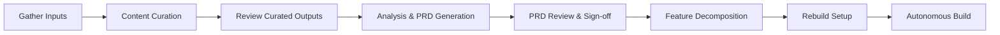

# AI-Enabled Legacy Modernisation Playbook

Version {{ site.version }}

This playbook describes how Defra's Legacy Application Programme (LAP) uses AI to reverse-engineer legacy applications and rebuild them. It covers the end-to-end process — from gathering source material through automated analysis to a signed-off PRD, feature specifications, and an autonomous build loop that implements the replacement application feature by feature.

## Sections

- [Overview]({{ "/pages/overview/" | relative_url }}) — what this playbook covers, team structure, and stakeholder roles
- [Process]({{ "/pages/process/" | relative_url }}) — step-by-step guide through each phase of the reverse engineering process
- [Tooling]({{ "/pages/tooling/" | relative_url }}) — AI coding assistants, plugins, and project directory structure
- [Output Reference]({{ "/pages/output-reference/" | relative_url }}) — detailed descriptions of each artefact the process produces
- [Considerations & Caveats]({{ "/pages/considerations/" | relative_url }}) — information governance, PII handling, AI quality, and costs
- [Glossary]({{ "/pages/glossary/" | relative_url }}) — key terms and definitions
- [Contributing]({{ "/pages/contributing/" | relative_url }}) — how to propose changes to this playbook

Start with the [Overview]({{ "/pages/overview/" | relative_url }}) for context, then follow the [Process]({{ "/pages/process/" | relative_url }}) guide.
