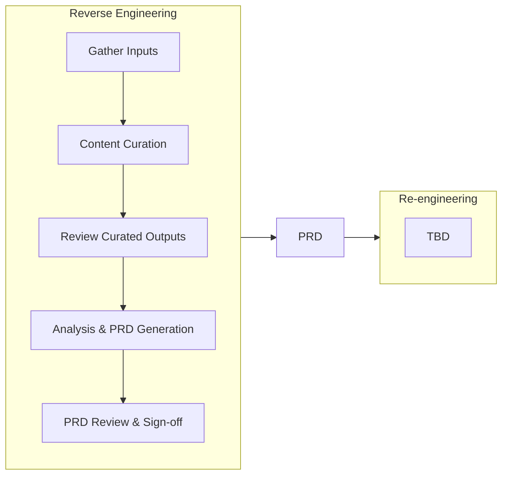

# AI-Enabled Legacy Modernisation Playbook

Version {{ site.version }}

This playbook describes how Defra's Legacy Application Programme (LAP) uses AI-assisted tooling to modernise legacy applications. It covers two distinct phases that can be used independently or together:

1. **Reverse Engineering** — analysing a legacy application to produce a comprehensive Product Requirements Document (PRD)
2. **Re-engineering** — using the PRD to design, build, and deploy a modern replacement

## Sections

- [Overview]({{ "/pages/overview/" | relative_url }}) — what this playbook covers, team structure, and stakeholder roles
- [Reverse Engineering]({{ "/pages/reverse-engineering/" | relative_url }}) — AI-assisted analysis of legacy applications to produce a signed-off PRD
- [Re-engineering]({{ "/pages/re-engineering/" | relative_url }}) — building a modern replacement from the PRD
- [Considerations & Caveats]({{ "/pages/considerations/" | relative_url }}) — information governance, PII handling, AI quality, and costs
- [Glossary]({{ "/pages/glossary/" | relative_url }}) — key terms and definitions
- [Contributing]({{ "/pages/contributing/" | relative_url }}) — how to propose changes to this playbook

Start with the [Overview]({{ "/pages/overview/" | relative_url }}) for context, then follow the phase relevant to your work.
