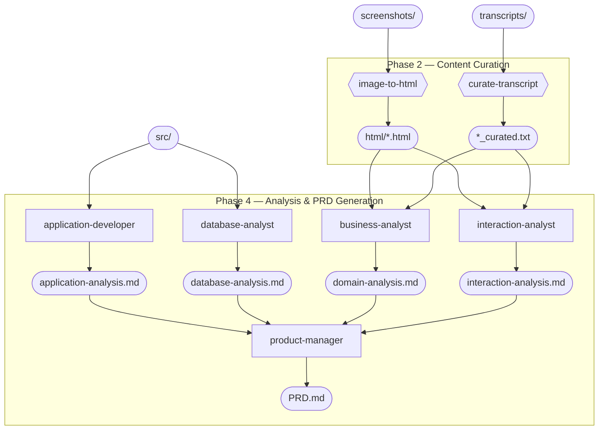

# Process Overview

The modernisation playbook follows a five-phase process that takes legacy application artefacts and produces a comprehensive Product Requirements Document (PRD). The diagram below shows the end-to-end flow.

## The Five Phases

1. **[Gather Inputs]({{ '/pages/process/gather-inputs/' | relative_url }})** — collect screenshots, source code, and stakeholder interview transcripts. These are the raw materials that feed every subsequent step.

2. **[Content Curation]({{ '/pages/process/content-curation/' | relative_url }})** — AI converts screenshots to semantic HTML mockups and curates transcripts by removing off-topic content while preserving domain knowledge verbatim.

3. **[Review Curated Outputs]({{ '/pages/process/review-curated-outputs/' | relative_url }})** — the team reviews HTML mockups and curated transcripts for quality, ensuring they faithfully represent the originals before automated analysis begins.

4. **[Analysis & PRD Generation]({{ '/pages/process/analysis-and-prd/' | relative_url }})** — four specialist AI analyst agents examine all inputs in parallel, and a product-manager agent synthesises their outputs into a comprehensive PRD.

5. **[PRD Review & Sign-off]({{ '/pages/process/prd-review-and-signoff/' | relative_url }})** — the team and stakeholders review and approve the PRD, marking the end of the reverse engineering phase.

## Mandatory Inputs

All three input types are required for the process to produce a complete and accurate PRD:

| Input | Directory | Purpose |
|-------|-----------|---------|
| Source code | `src/` | Provides the ground truth of application behaviour, business rules, and data model |
| UI screenshots | `screenshots/` | Captures the user-facing interface, screen layouts, and visible workflows |
| Stakeholder interview transcripts | `transcripts/` | Supplies domain context, business knowledge, and user perspectives that code alone cannot reveal |

## Final Output

The process produces a signed-off PRD published on GitHub. This document comprehensively describes the legacy application's behaviour, domain model, workflows, and business rules — ready for implementation planning.
