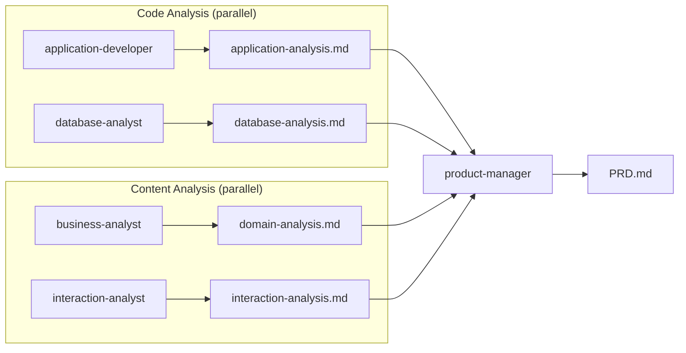

# Phase 4: Analysis & PRD Generation

The `product-manager` agent orchestrates four specialist analyst agents, then synthesises their outputs into a comprehensive Product Requirements Document (PRD). This runs as a single automated pipeline — no human intervention is required between the analysts and the synthesis step.

## The Four Analysts

### 1. Business Analyst (`business-analyst`)

Extracts strategic Domain-Driven Design patterns from curated transcripts and HTML mockups: ubiquitous language, bounded contexts, subdomains, and context maps.

**Output:** `output/domain-analysis.md`

### 2. Interaction Analyst (`interaction-analyst`)

Stitches HTML mockups with curated transcripts to produce a screen inventory, user workflows with Mermaid diagrams, and a screen navigation map.

**Output:** `output/interaction-analysis.md`

### 3. Application Developer (`application-developer`)

Comprehensively reads the legacy source code to extract workflows, behaviours, domain model, business rules, and integration points.

**Output:** `output/application-analysis.md`

### 4. Database Analyst (`database-analyst`)

Reads SQL and database code to extract schema, stored procedures, triggers, constraints, and database-level business rules.

**Output:** `output/database-analysis.md`

## Pipeline Execution

The pipeline stages run in parallel where possible. Code analysts (`application-developer`, `database-analyst`) run concurrently with content analysts (`business-analyst`, `interaction-analyst`). The synthesis step waits for all four to complete.

## The Synthesis

The `product-manager` reads all four analysis files, cross-references them, and produces `output/PRD.md` — a comprehensive Product Requirements Document structured around behaviour, domain model, workflows, and business rules.

## How to Run

Invoke the `product-manager` agent via your AI coding assistant with the appropriate plugin or extension loaded. The agent orchestrates all four analyst agents automatically and synthesises their outputs into `output/PRD.md`. See [Tooling]({{ '/pages/tooling/' | relative_url }}) for setup instructions.

For full agent definitions and configuration, see the [plugin repository]({{ '/pages/tooling/' | relative_url }}).
