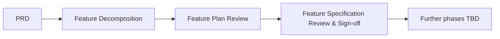

## Overview

The re-engineering phase takes a signed-off **Product Requirements Document (PRD)** produced by the [Reverse Engineering]({{ "/pages/reverse-engineering/" | relative_url }}) phase and uses it to design and build a modern replacement for the legacy application.

The PRD is the sole input. It contains the complete requirements for the legacy application, and the re-engineering process works entirely from this document.

The first step is **feature decomposition**: slicing the PRD into individually deliverable feature specifications that a development cycle can pick up and implement independently.

Further phases covering architecture design, implementation, and deployment will be added as the re-engineering process matures.

### Sections

- [Process]({{ "/pages/re-engineering/process/" | relative_url }}) — the re-engineering process, starting with feature decomposition
- [Tooling]({{ "/pages/re-engineering/tooling/" | relative_url }}) — agents used during the re-engineering phase
- [Output Reference]({{ "/pages/re-engineering/output-reference/" | relative_url }}) — artefacts produced during re-engineering
