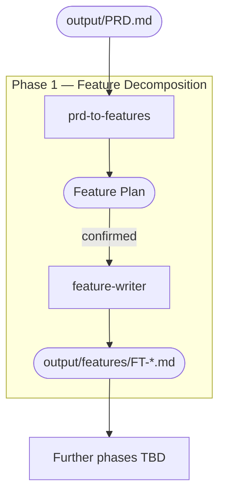

# Process Overview

The re-engineering process takes a signed-off Product Requirements Document (PRD) from the [Reverse Engineering]({{ '/pages/reverse-engineering/' | relative_url }}) phase and works towards a modern replacement for the legacy application. The first step is to decompose the PRD into individually deliverable feature specifications.

## Phases

1. **[Feature Decomposition]({{ '/pages/re-engineering/process/feature-decomposition/' | relative_url }})** — the `prd-to-features` agent reads the PRD, identifies natural feature boundaries, and produces a feature plan. After the plan is confirmed, it generates individual feature specification files in parallel.

2. **[Feature Plan Review]({{ '/pages/re-engineering/process/feature-plan-review/' | relative_url }})** — the team reviews the proposed feature breakdown for completeness, correct layering, and sensible scope before feature specifications are generated.

3. **[Feature Specification Review & Sign-off]({{ '/pages/re-engineering/process/feature-review-and-signoff/' | relative_url }})** — the team and stakeholders review the generated feature specifications for accuracy, coverage, and readiness for implementation.

Further phases covering architecture design and implementation will be added as the re-engineering process matures.

## Input

| Input | Location | Purpose |
|-------|----------|---------|
| Signed-off PRD | `output/PRD.md` | The sole input to the re-engineering phase — contains the complete requirements for the legacy application |

## Output

The process produces a set of feature specification files in `output/features/`, each describing an independently deliverable unit of work with user stories, acceptance criteria, wireframes, and business rules.
