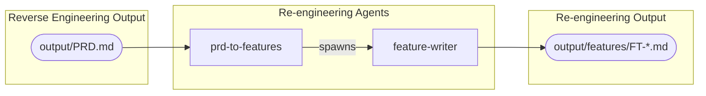

# Tooling

The re-engineering process uses the same AI coding assistants and plugin as the [Reverse Engineering]({{ '/pages/reverse-engineering/tooling/' | relative_url }}) phase. The plugin provides additional agents for the re-engineering workflow.

## Plugin setup

Follow the setup instructions in the [Claude Code Plugin]({{ '/pages/reverse-engineering/tooling/claude-code/' | relative_url }}) page. The same plugin installation covers both reverse engineering and re-engineering agents.

## Agents

The following agents are used during the re-engineering phase:

| Agent | Description |
|-------|-------------|
| `prd-to-features` | Reads the PRD, identifies feature boundaries, plans the implementation order, and spawns parallel feature-writer agents to generate feature specifications |
| `feature-writer` | Internal worker agent — writes a single feature specification file. Only spawned by `prd-to-features`, not for direct use |

## Component map

The following diagram shows how the re-engineering agents relate to one another and to the reverse engineering outputs.



## Project directory structure

The re-engineering phase extends the project directory with a `features/` subdirectory under `output/`:

```
project/
├── output/
│   ├── domain-analysis.md          (from reverse engineering)
│   ├── interaction-analysis.md     (from reverse engineering)
│   ├── application-analysis.md     (from reverse engineering)
│   ├── database-analysis.md        (from reverse engineering)
│   ├── PRD.md                      (from reverse engineering)
│   └── features/                   (from re-engineering)
│       ├── FT-001-feature-name.md
│       ├── FT-002-feature-name.md
│       └── ...
```
