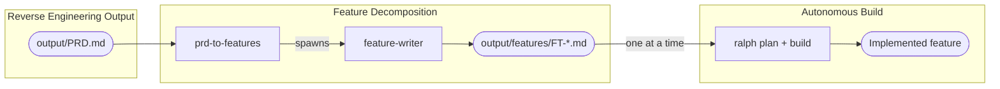

# Tooling

The re-engineering phase uses two tools:

- The **legacy reverse engineering plugin** — provides agents for feature decomposition (same plugin as the [Reverse Engineering]({{ '/pages/reverse-engineering/tooling/' | relative_url }}) phase)
- **ralph** — an autonomous AI coding loop runner for implementing features

## Plugin setup

Follow the setup instructions in the [Claude Code Plugin]({{ '/pages/reverse-engineering/tooling/claude-code/' | relative_url }}) page. The same plugin installation covers both reverse engineering and re-engineering agents.

### Feature decomposition agents

| Agent | Description |
|-------|-------------|
| `prd-to-features` | Reads the PRD, identifies feature boundaries, plans the implementation order, and spawns parallel feature-writer agents to generate feature specifications |
| `feature-writer` | Internal worker agent — writes a single feature specification file. Only spawned by `prd-to-features`, not for direct use |

## Ralph

[Ralph](https://github.com/marc0der/ralph) is an autonomous AI coding agent loop runner that implements the [Ralph Wiggum pattern](https://github.com/ghuntley/how-to-ralph-wiggum). It runs iterative plan/build cycles in headless mode, with shared artifacts as handoffs between iterations.

### Installation

```bash
git clone git@github.com:marc0der/ralph.git
cd ralph
./install.sh
```

See the [ralph README](https://github.com/marc0der/ralph#install) for full installation details and prerequisites.

### Prerequisites

- **Docker** (rootful) — required for the sandbox
- **devcontainer CLI** — `npm install -g @devcontainers/cli`
- **AI backend** — Claude Code or OpenAI Codex CLI installed and authenticated

### Key commands

| Command | Purpose |
|---------|---------|
| `ralph sandbox` | Enter the devcontainer (required for safe execution) |
| `ralph init` | Initialise workspace artifacts |
| `ralph plan` | Run the planning loop — analyse specs vs codebase, produce implementation plan |
| `ralph build` | Run the build loop — implement, test, commit, push, one item per iteration |
| `ralph archive` | Archive loop artifacts before starting the next feature |

See the [ralph README](https://github.com/marc0der/ralph#commands) for the full command reference, options, and model selection.

## Component map

The following diagram shows how the re-engineering tools relate to one another.



## Project directory structure

The re-engineering phase extends the project directory across two locations:

**Reverse engineering project** (where the PRD lives):

```
re-project/
├── output/
│   ├── PRD.md                      (from reverse engineering)
│   └── features/                   (from feature decomposition)
│       ├── FT-001-feature-name.md
│       ├── FT-002-feature-name.md
│       └── ...
```

**Target application project** (where ralph builds):

```
app-project/
├── CLAUDE.md                       (operational guardrails — you maintain)
├── IMPLEMENTATION_PLAN.md          (created by ralph plan)
├── PROGRESS.md                     (append-only log by ralph build)
├── specs/
│   └── FT-001-feature-name.md     (copied from re-project)
├── src/
│   └── ...                         (implemented code)
└── test/
    └── ...                         (tests)
```
