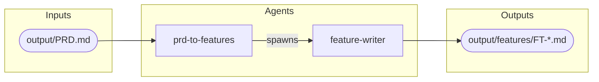

# Claude Code Plugin

The re-engineering phase uses the same legacy reverse engineering plugin as the [Reverse Engineering]({{ '/pages/reverse-engineering/tooling/' | relative_url }}) phase, extended with a set of agents for feature decomposition.

## Prerequisites and installation

See the [Claude Code Plugin]({{ '/pages/reverse-engineering/tooling/claude-code/' | relative_url }}) page for prerequisites and installation. The same plugin installation covers both reverse engineering and re-engineering agents.

## Running with the plugin

Launch Claude Code with the plugin directory:

```bash
claude --plugin-dir /path/to/claude-legacy-reveng-plugin
```

Or set up a shell alias for convenience:

```bash
alias claude-lap='claude --plugin-dir /path/to/claude-legacy-reveng-plugin'
```

## Feature decomposition agents

| Agent | Description |
|-------|-------------|
| `prd-to-features` | Reads the PRD, identifies feature boundaries, plans the implementation order, and spawns parallel feature-writer agents to generate feature specifications |
| `feature-writer` | Internal worker agent — writes a single feature specification file. Only spawned by `prd-to-features`, not for direct use |

## Component map

The following diagram shows how the feature decomposition agents relate to one another.



## Further information

Refer to the plugin repository for full documentation, including detailed agent definitions.
