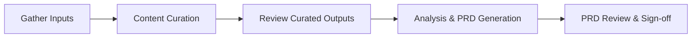

## Overview

The reverse engineering phase takes a legacy application and produces a comprehensive **Product Requirements Document (PRD)** that captures what the application does, why it does it, and what a modern replacement would need to deliver.

It uses generative AI to automate the heavy analytical work — reading source code, interpreting UI screenshots, and structuring stakeholder knowledge — so a small team can focus on steering, validating, and engaging stakeholders.

### Inputs

Three types of artefact are required:

- **Source code** — the application's complete codebase
- **UI screenshots** — captured screens from the running application
- **Stakeholder interview transcripts** — recorded conversations with application users and product owners

### Output

A signed-off PRD ready to hand off to the [Re-engineering]({{ "/pages/re-engineering/" | relative_url }}) phase.

### Process

The process runs through five phases:

1. **[Gather Inputs]({{ '/pages/reverse-engineering/process/gather-inputs/' | relative_url }})** — collect screenshots, source code, and interview transcripts
2. **[Content Curation]({{ '/pages/reverse-engineering/process/content-curation/' | relative_url }})** — AI converts raw inputs into structured, analysis-ready formats
3. **[Review Curated Outputs]({{ '/pages/reverse-engineering/process/review-curated-outputs/' | relative_url }})** — the team reviews curated outputs for quality
4. **[Analysis & PRD Generation]({{ '/pages/reverse-engineering/process/analysis-and-prd/' | relative_url }})** — specialist AI agents analyse all inputs and synthesise a PRD
5. **[PRD Review & Sign-off]({{ '/pages/reverse-engineering/process/prd-review-and-signoff/' | relative_url }})** — stakeholders review and approve the PRD

### Sections

- [Process]({{ "/pages/reverse-engineering/process/" | relative_url }}) — step-by-step guide through each phase
- [Tooling]({{ "/pages/reverse-engineering/tooling/" | relative_url }}) — AI coding assistants, plugins, and project directory structure
- [Output Reference]({{ "/pages/reverse-engineering/output-reference/" | relative_url }}) — detailed descriptions of each artefact the process produces
