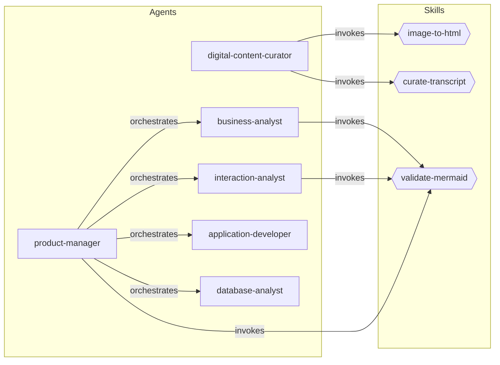

# Claude Code Plugin

This page covers the Claude Code plugin that powers the reverse engineering process. The plugin provides a set of skills (slash commands) and agents (autonomous subagents) that together analyse legacy applications and produce structured deliverables.

## Prerequisites

You must have Claude Code installed and authenticated before using the plugin.

See the official Claude Code documentation: [https://docs.anthropic.com/en/docs/claude-code](https://docs.anthropic.com/en/docs/claude-code)

This plugin is not published on the marketplace yet, and in the interim, you can clone the plugin from its GitHub repository:

```bash
git clone https://github.com/DEFRA/claude-legacy-reveng-plugin
```

## Running with the plugin

Launch Claude Code with the plugin directory:

```bash
claude --plugin-dir /path/to/claude-legacy-reveng-plugin
```

Or set up a shell alias for convenience:

```bash
alias claude-lap='claude --plugin-dir /path/to/claude-legacy-reveng-plugin'
```

## Skills

Skills are slash commands that perform focused, single-purpose tasks.

| Skill | Description |
|-------|-------------|
| `image-to-html` | Converts a legacy UI screenshot into semantic, unstyled mockup HTML |
| `curate-transcript` | Removes off-topic content from interview transcripts whilst preserving domain knowledge verbatim |
| `validate-mermaid` | Validates all Mermaid diagram blocks in a markdown file and fixes broken diagrams in place |

## Agents

Agents are autonomous subagents that carry out broader analysis tasks.

| Agent | Description |
|-------|-------------|
| `digital-content-curator` | Prepares raw screenshots and transcripts into structured, analysis-ready outputs |
| `business-analyst` | Extracts strategic DDD patterns from curated transcripts and HTML mockups |
| `interaction-analyst` | Produces screen inventory, user workflows, and navigation maps from mockups and transcripts |
| `application-developer` | Reads legacy .NET source code to extract workflows, behaviours, domain model, and business rules |
| `database-analyst` | Reads SQL Server database code to extract schema, stored procedures, and database-level business rules |
| `product-manager` | Orchestrates all analysts and synthesises a comprehensive PRD |

## Component map

The following diagram shows how skills and agents relate to one another.



## Further information

Refer to the plugin repository for full documentation, including detailed agent and skill definitions.
